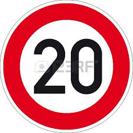
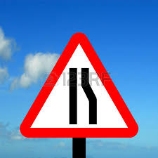

# Traffic Sign Classifier 

## Overview
Develop a Deep Learning Network to classify traffic signs. To accomplish this a Convolutional Neural Network (CNN) is developed to classify traffic signs. Specifically the CNN will focus on German traffic signs: [German Traffic Sign Dataset](http://benchmark.ini.rub.de/?section=gtsrb&subsection=dataset). Many aspects of TensorFlow, OpenCV, python, numpy, and matplotlib are used to develop the CNN in a jupyter notebook environment. The code can be found here  [project code](https://github.com/jfoshea/TrafficSignClassifier/blob/master/TrafficSignClassifier.ipynb)

The steps for running the CNN in the jupyter notebook environment are:
- Get the test data and display attributes
- Visualize the test data
- Pre-process (stage-1): Balance the data set
- Pre-process (stage-2): Equalize and normalize the data set
- Describe the TrafficSignNet Architecture
- Train, validate and test the model
- Outline the features and labels
- Outline the training pipeline
- Model evaluation
- Train the model
- Evaluate the model
- Test the modeil with random traffic sign images found from the web
- Predict the sign type for each image found from the web
- Output Top 5 softmax probabilities for each image found on the web

## Get the Test Data and Display Attributes
The test_data is a set of pickle files in dictionary format with 4 key/value pairs:
- `features` A 4D array of raw pixel data of the traffic sign images, (num examples, width, height, channels).
- `labels` A 1D array containing the label/class id of the traffic sign. The file `signnames.csv` contains id -> name mappings for each id.
- `sizes` A list of tuples, (width, height) representing the original width and height the image.
- `coords` A list of tuples, (x1, y1, x2, y2) representing coordinates of a bounding box around the sign in the image.

## Visualize the Test Data
The data set is quite large 34799 images in training, 4410 images in validation, 12630 in test. These images are spread across 43 classes, the file [signnames.csv](https://github.com/jfoshea/TrafficSignClassifier/blob/master/signnames.csv) denotes each class and label. Rather than plotting every image a better visualization representation is to plot the first image from each class in training, validation, and testing groups. A histogram is also plotted for each of the three data sets to get an idea of the distribution of images in each class. Several class ids in the histogram are under represented compared to other class ids.These under represented classes will have a lower probablity of predicting a traffic sign because of lack of data. Later I will balance the distribution to increase images in low class ids.

The following jupyter notebook cells are used to visualize the data set:
- **Cell 4**: Training set sample images
- **Cell 5**: Training set Histogram 
- **Cell 6**: Validation set sample images 
- **Cell 7**: Validation set Histogram 
- **Cell 8**: Test set sample images
- **Cell 9**: Test set Histogram 

## Pre-process the data set

Several considerations were considered for pre-processing the data.
- What is the distribution across the training set?
- What is the contrast of the images in the training set?
- What are the benefits to converting the data set from RGB to gray scale or RGB to HSV ?
 
### Distribution of Training Set
 The first observation from looking at a histogram of the training set is that the distribution is not balanced. The classid min and max is 210 and 2010 which is a wide range. The ideal solution would be to have an equal number of images per class but this would take a lot pre-processing. I felt a compromise solution would be to compute the mean (classid mean = 810) and then add images that are underrepresented until the mean is reached. To add some variance in the images, I decided to rotate an image from each class by randomly selecting an angle from the range -25 degreed to + 25 degrees. The new histogram in **Cell 10** looks more balanced and will provide better variance for training.

### Color Conversion, Normalization, Equalization
My initial instinct was to convert images to gray scale as I felt this would reduce the image size and would help reduce the overhead during training. After a few trial runs I didnt see any real difference in probabilities during training EPOCHS when compared to RGB format.  On second thought I felt that color does have meaning in traffic signs so I decided to keep the images in color format.  I then tried converting the dataset from RGB to HSV as I felt HSV may be better for with images with varying contrast within each class, however again I did not see any major difference, so I decided to stay with RGB format as is documented in this jupyter notebook. I then came across histogram equalization [Histogram Equalization](https://docs.opencv.org/3.1.0/d5/daf/tutorial_py_histogram_equalization.html) and felt this pre-processing technique would benefit in higher probabilities during training. I ran the dataset using `cv2.EqualizeHist` across all three channels globally to the image. The techique improved the training results. In the same article I read about `Contrast Limited Adaptive Histogram Equalization (CLAHE)`, this method applies equalization in smaller tiles across the image and in theory should give better result. I tried 4x4 tiling and 8x8 tiling, and more often than not I see higher probabilities with 4x4 tiling.

Finally I applied normalization to the data set for zero mean and equal variance using the suggested method `(pixel - 128)/ 128`. 

A visualization of the preprocessed dataset can be seen in **Cell 12** of the jupyter notebook.

### TrafficSignNet Architecture
The LeNet Convolutional Neural Network is well know architecture for classifying MNIST data (digits 0-9). I decide to use this this reference design and to adjust it classify the German Traffic sign data set. 

I spent a lot of time experimenting with many hyper-parameters and pre-processing techniques to try and get a high training score. I probably spent too much time on this but I wanted to satisfy my own curiousity with different techniques. Overall I had varying success with tuning different hyper-parameters and re-running trial runs with the same hyper-parameters. There is definitely an exercise worth doing as it provides valuable experience and insight into what works for building a CNN. 

I noticed during training trials that a peak was being set halfways through the training process and then the probabilities oscillated slightly for the remaining EPOCHS. Also I noticed from evaluating the model **Cell 18** that was over-fitting was happening. In order to improve the model and reduce over-fitting I decided to try Dropout. Dropout is a form of regularisation where weights are kept with a probability p and the unkept weights are dropped. Intuitively then this prevents the model from overfitting. Dropout was pioneered by Geoffrey Hinton in the University of Toronta. 
[Dropout: A Simple Way to Prevent Neural Networks from Overfitting](http://jmlr.org/papers/volume15/srivastava14a/srivastava14a.pdf)

I then went back to the basic CNN model based on LeNet and simply experimented by adding a Dropout after each Regularization layer and I noticed that a peak in the probabilty for training was reached earlier and I noticed the evaluation accuracy improved, i.e. the delta between Training and Validation set accuracies was reduced. I have run many training sessions with Dropout and it definitely helps with final architecture of the Model. I am consistently getting 96%+ probability after training, sometimes 97%+ probability. 

| **Layer** | **Input** | **Output** | **Description**                                               
|-----------|-----------|------------|---------------- 
| | | |                                                                   
| **Layer 1** | 32x32x3 | 28x28x6 | Convolutional Layer
| | | |                                                                   
| | | | **conv1_W**                                                           
| | | | - Uses a 5x5 filter with input depth=3, output depth=6              
| | | | - output_height = (input_height - filter_height)+1/vertical_stride  
| | | | - output_width = (input_height - filter_width)+1/horizontal_stride  
| | | |     - i.e. 32-5+1/1 = 28                                              
| | | |                                                                   
| | | | **conv1_b**                                                           
| | | | - The Bias vector length = output_depth                             
| | | |                                                                   
| | | | **conv1**                                                             
| | | | - Convolve the filter over the images and add bias                   
| | | | - Activate the output of conv1 with a RELU activation function      
| | | | - Pool the output with a 2x2 kernel with a 2x2 stride which gives   
| | | | a pooling output of 14x14x6                                       
| | | |                                                                   
| | | | **Dropout**                                                           
| | | | - Add a dropout layer with keep_prob 0.8                            
| | | |                                                                   
| **Layer 2** | 14x14x6 | 5x5x6 | Convolutional Layer
| | | | **conv1_W**                                                           
| | | | - Uses a 5x5 filter with input depth=3, output depth=6              
| | | | - output_height = (input_height - filter_height)+1/vertical_stride  
| | | | - output_width = (input_height - filter_width)+1/horizontal_stride  
| | | |     - i.e. 32-5+1/1 = 28                                              
| | | |                                                                   
| | | | **conv1_b**                                                           
| | | | - The Bias vector length = output_depth                             
| | | |                                                                   
| | | | **conv1**                                                             
| | | | - Convolve the filter over the images and add bias                   
| | | | - Activate the output of conv1 with a RELU activation function      
| | | | - Pool the output with a 2x2 kernel with a 2x2 stride which gives   
| | | | a pooling output of 14x14x6                                       
| | | |                                                                   
| | | | **Dropout**                                                           
| | | | - Add a dropout layer with keep_prob 0.8                            
| | | |                                                                   
| **Layer 3** | 400 | 120 | Fully Connected Layer
| | | |                                                                   
| **Layer 4** | 120 | 84 | Fully Connected Layer
| | | |                                                                   
| **Layer 5** | 84 | 43 | Fully Connected Layer

## Train, Validate and Test the Model
The results from evaluatng the model shows high accuracy on training set and lower accuracy on the validation set which implies some overfitting is still happening. I will experiment more in the future to reduce the overfitting, perhaps add more Dropout layers.

| DataSet | Accuracy | Conclusion 
|---------|----------|--------- 
| Training Set | 0.999 |
| Validation Set | 0.965 | slight overfitting 
| Test Set | 0.961 |

## Test a Model on New Images
Here are the random traffic signs that I found on the web:

## Prediction of New Images and Top 5 Softmax for each image

### Predictions

|   Image			            |     Prediction	            | Result
|-------------------------------|-------------------------------|--------- 
| (00) Speed limit (20 Km/h)    | (00) Speed limit (20km/h)     | Correct 
| (07) Speed limit (100 Km/h)   | (25) Road Work                | Incorrect
| (12) Priority Road Sign       | (12) Priority Road Sign       | Correct
| (24) Road Narrows Right       | (24) Road Narrows Right       | Correct
| (35) Ahead Only			    | (35) Ahead Only		        | Correct
| (40) Roundabout Mandatory     | (40) Roundabout Mandatory     | Correct

I have run many training and prediction trials and I typically get 80-83.3% success. I have noticed that a higher probability in EPOCHS 97%+ does not always yield better final predictions. In the trial run shown here, the model was able to correctly guess 5 of the 6 traffic signs, which gives an accuracy of 83.3%. The second image "100Km/h" was predicted to be "Road work" which seems strange on first impression as the shape of 100 is round and road work is triangle shape. However the sample image for 100Km/h is a "distorted" image as it looks more oblong or eclipse shape which probably confused the prediction. The softmax probability for *Speed limit (100Km/h)* is 0.9518, in theory this should yield a good prediction. 

The softmax probability was perfect (100%) for **Road Narrows Right** and **Ahead Only**. The softmax probability for images **Speed limit (100Km/h)** and **Roundabout mandatory** have high of 90% probability of success", and finally images **Speed limt (20Km/h)**, **Road Narrows Right** had a probability of 70%+ which could be higher but the model still correctly predicted both images. 

### Top 5 Softmax 

| Image | Top 5 SoftMax 
|----------------------|--------------- 
| Speed limit (20km/h) | **1.** 0.7086
| | **2.** 0.2724
| | **3.** 0.0097
| | **4.** 0.0080
| | **5.** 0.0007
| Speed limit (100km/h) | **1.** 0.9518
| | **2.** 0.0153
| | **3.** 0.0088
| | **4.** 0.0066
| | **5.** 0.0053
| Priority road | 1. 1.0000
| | **2.** 0.0000
| | **3.** 0.0000
| | **4.** 0.0000
| | **5.** 0.0000
| Road narrows on the right | **1.** 0.7105
| | **2.** 0.2279
| | **3.** 0.0243
| | **4.** 0.0164
| | **5.** 0.0152
| Ahead only | **1.** 1.0000
| | **2.** 0.0000
| | **3.** 0.0000
| | **4.** 0.0000
| | **5.** 0.0000
| Roundabout mandatory | **1.** 0.9865
| | **2.** 0.0123
| | **3.** 0.0006
| | **4.** 0.0003
| | **5.** 0.0001
      

